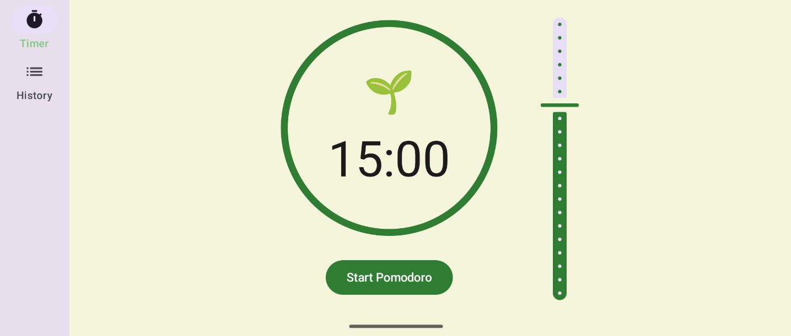

# Quiet Garden 🌱



Android Pomodoro timer app built at [The Recurse Center](https://recurse.com/) using Jetpack Compose as a personal project.

The app features a circular progress timer with start/stop controls and adjustable duration via a slider. Sessions are saved to a local database so you can track your focus history.

### Running the app

Clone the repo:
```bash
git clone https://github.com/nadia-nh/rc-android-pomodoro.git
cd rc-android-pomodoro
```

Open the project in Android Studio and run it on an emulator or device.

### How the App Works

The app follows the MVVM architecture pattern:

- **MainActivity**  
  Entry point that sets up the Compose UI and initializes the ViewModel with the Room database.

- **PomodoroMain**  
  Root composable that handles navigation between screens using a bottom bar in portrait mode and a navigation rail in landscape mode.

- **PomodoroScreen**  
  Main timer screen with:
  - Circular progress indicator showing time remaining
  - Dynamic emoji that changes based on progress (🌱 → 🌿 → 🌸)
  - Start/Stop button
  - Slider to select duration (1-45 minutes)

- **HistoryScreen**  
  Displays a list of completed Pomodoro sessions with timestamps.

- **PomodoroViewModel**  
  Manages timer state (running, paused, time remaining), handles navigation, and coordinates with the database for session persistence.

- **PomodoroDatabase / PomodoroSessionDao**  
  Room database for storing completed Pomodoro sessions.

### Tech Stack

- **Jetpack Compose** – Modern declarative UI toolkit
- **Room** – Local SQLite database
- **Kotlin Coroutines & Flow** – Asynchronous programming and reactive state
- **Material Design 3** – UI components and theming

---

Made with <3 at [The Recurse Center](https://recurse.com).  
